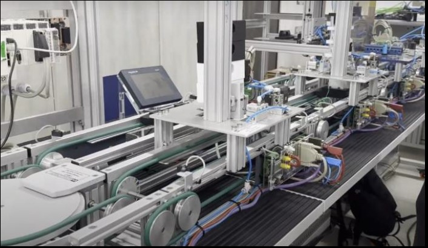
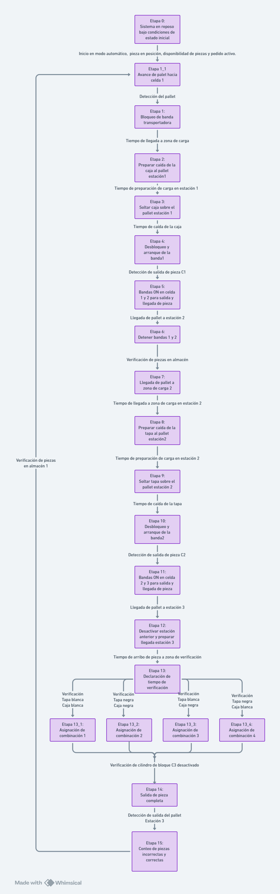
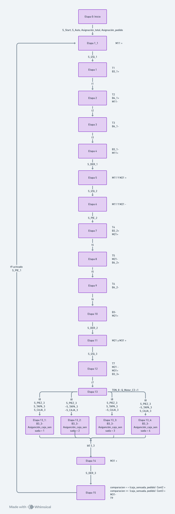
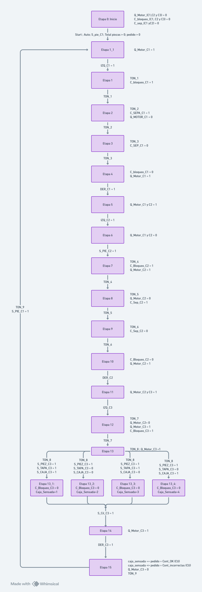
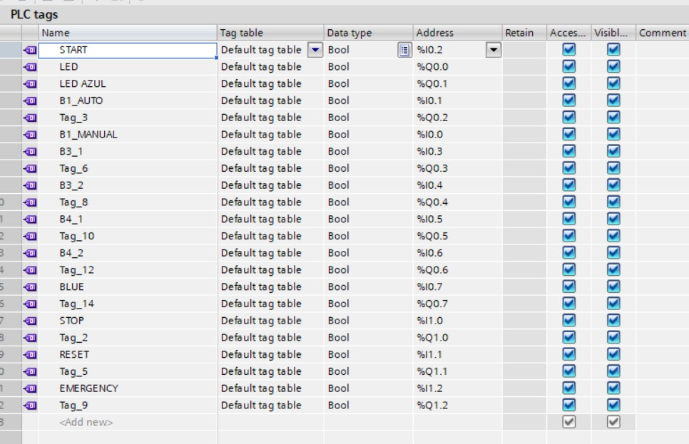
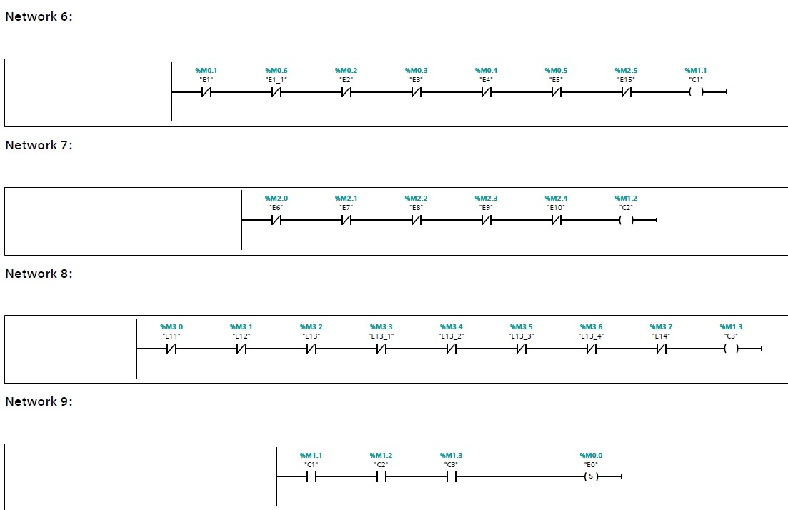
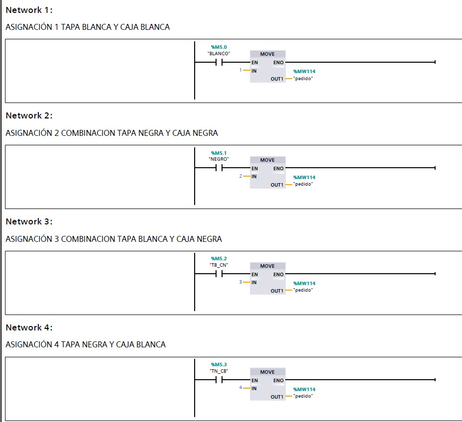
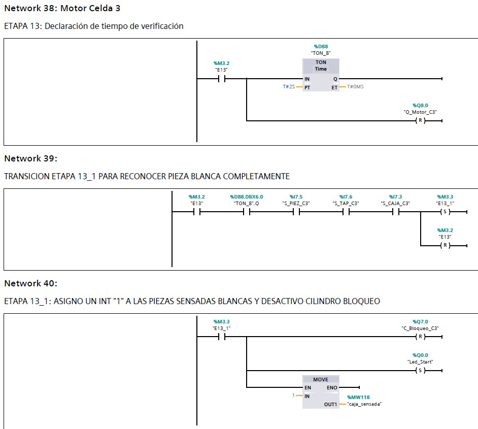

# Automated Manufacturing Cell for Base and Lid Assembly

Automation of a manufacturing cell for the assembly and inspection of products composed of a base and a lid.

The project focuses on the sequential control of three manufacturing stations responsible for base feeding, lid assembly, and final product inspection. The control strategy was designed using GRAFCET and implemented in Siemens TIA Portal using Ladder Logic.

The system coordinates conveyor motors, pneumatic mechanisms, sensors, timers, and production counters to execute the complete assembly cycle and verify whether the manufactured product matches the requested configuration.

## Project Overview

The objective of this project was to design and implement an automated control system for the first three stations of a manufacturing cell.

The system transports a pallet through different stages of the production process. A base is first placed on the pallet, followed by a lid at the second station. The assembled product is then transferred to an inspection station, where its configuration is identified and compared with the requested product.

The automation was developed following a sequential-control approach:

1. Identification of the required PLC inputs and outputs.
2. Design of the manufacturing sequence using GRAFCET.
3. Implementation of the control logic in Siemens TIA Portal.
4. Testing of the sequence on the physical manufacturing cell.
5. Adjustment of timers, transitions, sensors, and actuator commands.
6. Implementation of product identification and production monitoring.

## Manufacturing Cell



The project was implemented on a physical manufacturing cell composed of three sequential stations.

Each product is transported on a pallet through the following operations:

- Base feeding
- Lid assembly
- Product inspection and verification

The PLC coordinates the movement of the pallet between stations and controls the motors, blocking mechanisms, separation mechanisms, and sensors required for each stage of the process.

## Project Objectives

The main objective was to automate the first three stations of the manufacturing cell in order to coordinate the assembly process and perform automatic product verification.

The main tasks included:

- Developing the sequential control of the manufacturing process.
- Controlling pallet transportation between stations.
- Managing the base and lid feeding mechanisms.
- Integrating position and component-detection sensors.
- Identifying different base and lid combinations.
- Comparing the manufactured product with the requested configuration.
- Counting correctly and incorrectly assembled products.
- Translating the GRAFCET sequence into Ladder Logic.

## Manufacturing Process

The automated process is divided into three main stations.

### Station 1 — Base Feeding

The first station is responsible for introducing the base into the manufacturing sequence.

When the system is operating in automatic mode and the required start conditions are satisfied, the first conveyor moves the pallet toward the loading position.

A position sensor detects the pallet and the conveyor is stopped. A blocking mechanism holds the pallet in position while the base feeding sequence is performed.

The separation mechanism then releases a base onto the pallet.

After the loading operation is completed, the pallet is released and transported toward the second station.

### Station 2 — Lid Assembly

The second station performs the lid loading operation.

When the pallet reaches the station, the system checks the corresponding presence and position conditions before continuing.

The pallet is stopped and held in the loading area. The lid separation mechanism is then activated to release the lid onto the base.

Once the operation is completed, the blocking mechanism is released and the conveyors transfer the assembled product toward the third station.

### Station 3 — Product Inspection

The third station is responsible for inspecting the assembled product.

The pallet is positioned in the verification area and the corresponding sensors are evaluated to identify the base and lid combination.

The detected configuration is assigned an internal identification value.

This value is then compared with the product configuration requested at the beginning of the manufacturing process.

According to the result, the product is registered as either correctly or incorrectly assembled.

## Product Configurations

The system handles four possible combinations of base and lid colors.

| Product ID | Lid | Base |
|:----------:|:---:|:----:|
| 1 | White | White |
| 2 | Black | Black |
| 3 | White | Black |
| 4 | Black | White |

Before production begins, the requested combination is represented internally by an integer value.

At the inspection station, the sensor signals are evaluated and the detected product is assigned its corresponding identification value.

The PLC then performs the following comparison:

```text
Detected Product == Requested Product
```

If both values are equal, the product is counted as correctly assembled.

If the values are different, the product is counted as incorrectly assembled.

This provides a basic quality-control function directly within the PLC sequence.

## Control Strategy

The manufacturing sequence was designed using GRAFCET before being implemented in Ladder Logic.

GRAFCET was used to divide the process into individual stages and define the conditions required to move from one stage to another.

The sequence includes:

- Initial operating conditions
- Pallet transportation
- Pallet positioning
- Conveyor control
- Base feeding
- Lid feeding
- Sensor-based transitions
- Timed operations
- Product inspection
- Product classification
- Production counting
- Automatic cycle repetition

Three levels of GRAFCET were developed to progressively describe the automation sequence.

## GRAFCET Design

### Level 1 — Functional Process Description



The first level provides a functional description of the complete manufacturing sequence.

It focuses on the main operations performed by the system, including pallet transportation, base feeding, lid assembly, and final product verification.

This representation provides an overall view of the process without focusing on the specific PLC variables used in the implementation.

### Level 2 — Sequential Control Logic



The second level introduces the sequential control actions and the conditions required to transition between stages.

It defines the relationship between the different manufacturing operations and shows how the process progresses according to sensor states, timing conditions, and the completion of previous operations.

### Level 3 — Detailed Control Sequence



The third level connects the GRAFCET sequence with the variables used in the PLC implementation.

It includes the signals associated with:

- Conveyor motors
- Position sensors
- Blocking mechanisms
- Separation mechanisms
- Timers
- Internal sequence states
- Product inspection sensors

This level served as the main reference for translating the sequence into Ladder Logic.

## PLC Implementation

The control program was implemented in Siemens TIA Portal using Ladder Logic.

The program follows the sequence previously defined through the GRAFCET and uses internal states to represent the different stages of the manufacturing process.

The implementation includes:

- Sequential state management
- Set/reset logic
- Digital input processing
- Digital output control
- Conveyor motor commands
- Pneumatic actuator commands
- TON timers
- Counters
- Product configuration assignment
- Product identification
- Correct/incorrect product comparison
- Automatic cycle restart
- Stop and reset logic

## PLC Inputs and Outputs

The automation system uses digital inputs and outputs to connect the PLC with the physical elements of the manufacturing cell.



The PLC receives information from elements such as:

- Start and stop controls
- Automatic/manual operating controls
- Pallet position sensors
- Component presence sensors
- Inspection sensors

The PLC outputs control elements such as:

- Indicator lights
- Conveyor motors
- Pallet blocking mechanisms
- Base separation mechanism
- Lid separation mechanism
- Pneumatic actuators

The input/output mapping allows the PLC program to connect the GRAFCET states with the physical behavior of the manufacturing cell.

## Ladder Logic Implementation

Selected sections of the Ladder Logic program are shown below to illustrate how the GRAFCET sequence was translated into PLC control logic.

### Initial GRAFCET Logic



This section implements the initial part of the GRAFCET sequence.

Before beginning the manufacturing cycle, the PLC checks the required operating conditions, including the start command, automatic operation, product availability, and the requested production conditions.

Once the conditions are satisfied, the first internal state of the sequence is activated.

From this point, the process progresses through the different GRAFCET stages according to sensor signals and transition conditions.

### Requested Product Assignment



The program allows the desired product combination to be defined before the manufacturing process begins.

Each possible base and lid combination is represented by an integer value:

```text
1 → White lid / White base
2 → Black lid / Black base
3 → White lid / Black base
4 → Black lid / White base
```

The selected value is stored internally as the requested product.

This variable is maintained throughout the manufacturing sequence and is later compared with the product detected at the inspection station.

### Assembly Verification Logic



At the third station, the PLC evaluates the inspection sensor signals to determine the configuration of the assembled product.

Depending on the detected combination, the program assigns the corresponding identification value to the manufactured product.

The detected value is then compared with the requested product configuration.

This logic makes it possible to automatically determine whether the manufactured assembly corresponds to the production request.

## Timers and Sequential Coordination

TON timers are used throughout the control program to coordinate operations that require a defined amount of time before the next stage can begin.

The timers are used in operations such as:

- Pallet positioning
- Preparation of the loading areas
- Base release
- Lid release
- Product arrival at the inspection station
- Product verification
- Transition to the next manufacturing cycle

The timers work together with physical sensor signals and internal sequence states.

This combination prevents the sequence from progressing until the corresponding operation has been completed.

## Production Monitoring

The PLC program includes counters to monitor the manufacturing process.

The system manages values associated with:

- Requested production quantity
- Correctly assembled products
- Incorrectly assembled products

At the final stage of the process, the detected product is compared with the requested product.

For a matching product:

```text
Detected Product = Requested Product
```

the correct-product counter is incremented.

For a non-matching product:

```text
Detected Product ≠ Requested Product
```

the incorrect-product counter is incremented.

After the verification process, the sequence can return to the beginning and process another pallet while additional production is required.

## Simplified Operating Sequence

The overall manufacturing process can be summarized as follows:

```text
Select product configuration
           |
           v
 Enable automatic operation
           |
           v
     Detect pallet
           |
           v
   Station 1: Base feeding
           |
           v
 Transfer pallet to Station 2
           |
           v
   Station 2: Lid assembly
           |
           v
 Transfer pallet to Station 3
           |
           v
 Station 3: Product inspection
           |
           v
 Identify assembled configuration
           |
           v
 Compare detected and requested product
           |
     +-----+-----+
     |           |
   Match      No Match
     |           |
     v           v
  Correct     Incorrect
  counter      counter
     |           |
     +-----+-----+
           |
           v
      End of cycle
           |
           v
 Process next product if required
```

## Results

The implemented control system coordinated the assembly operations of the three manufacturing stations.

The final solution was able to:

- Control pallet transportation through the manufacturing cell.
- Coordinate the operation of the three stations.
- Control conveyor motors and pneumatic mechanisms.
- Perform automatic base feeding.
- Perform automatic lid feeding.
- Identify four different product configurations.
- Compare the assembled product with the requested configuration.
- Count correctly assembled products.
- Count incorrectly assembled products.
- Repeat the manufacturing sequence automatically.

The use of GRAFCET provided a structured way to design the sequential behavior of the manufacturing cell before implementing the control strategy in Ladder Logic.

Testing and adjustment of the program were performed on the manufacturing cell to refine the timing, sensor conditions, and transitions between the different stages.

## Technologies and Concepts

The project involved the application of the following technologies and industrial automation concepts:

- Siemens TIA Portal
- PLC Programming
- Ladder Logic (LAD)
- GRAFCET
- Industrial Automation
- Sequential Control
- Digital Inputs and Outputs
- Sensors and Actuators
- Conveyor Systems
- Pneumatic Actuation
- TON Timers
- PLC Counters
- Manufacturing Systems
- Product Identification
- Automated Quality Control
- Production Monitoring

## Authors

**Juan C. Aguirre**  
Mechatronics Engineering  
Universidad Tecnológica de Pereira

**Santiago M. Echeverri**  
Mechatronics Engineering  
Universidad Tecnológica de Pereira

Project developed as part of an Industrial Automation course at Universidad Tecnológica de Pereira.
